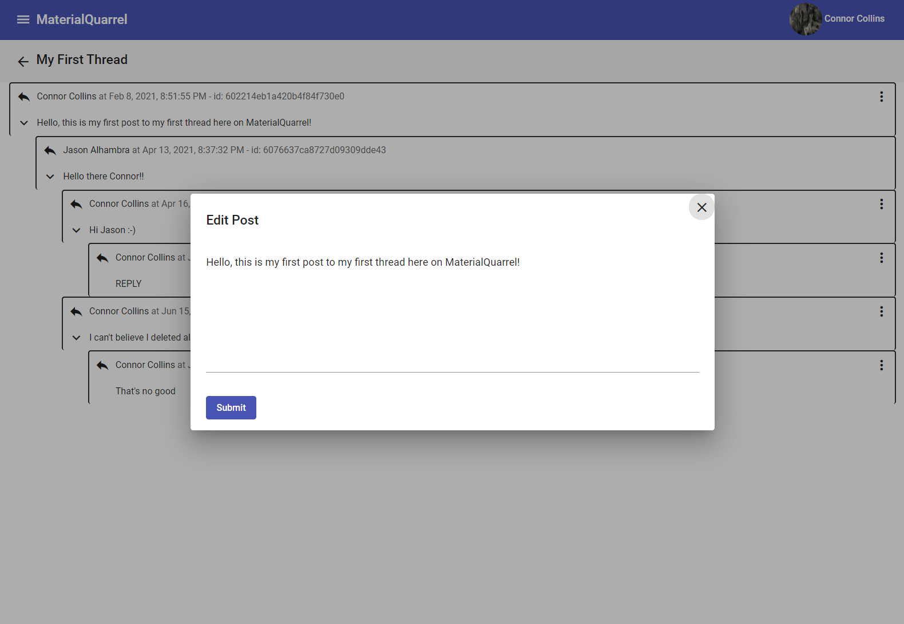
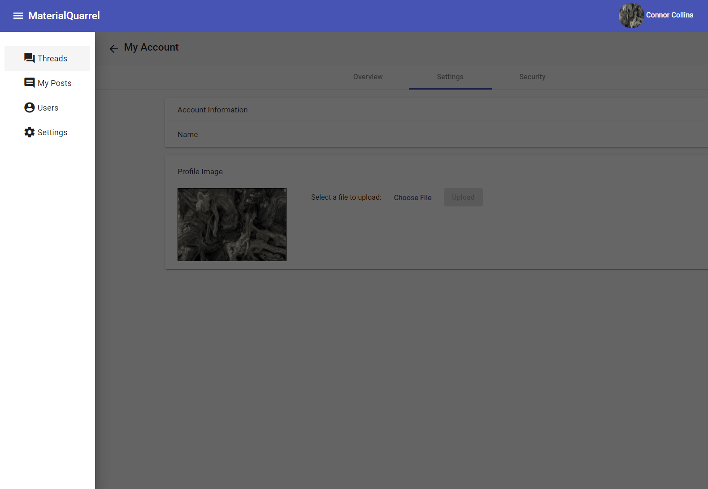
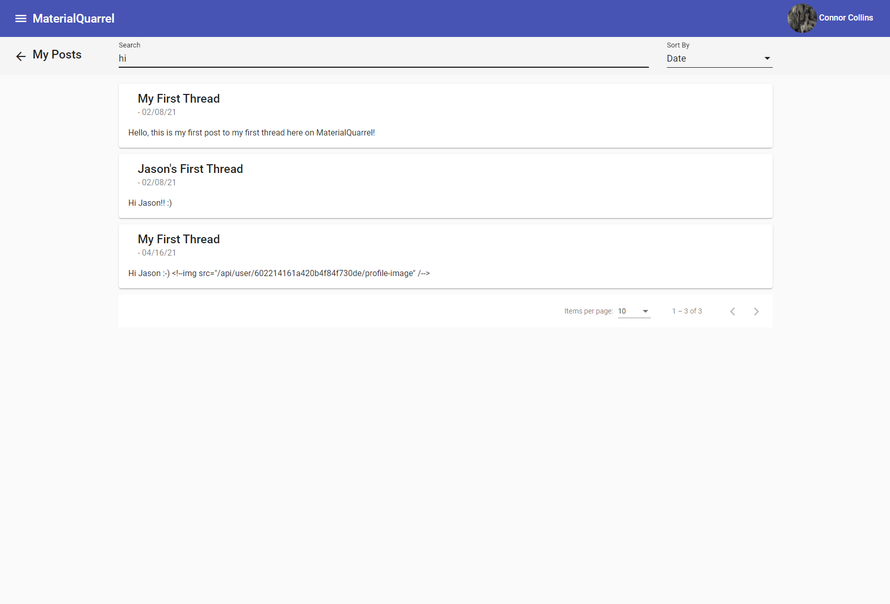
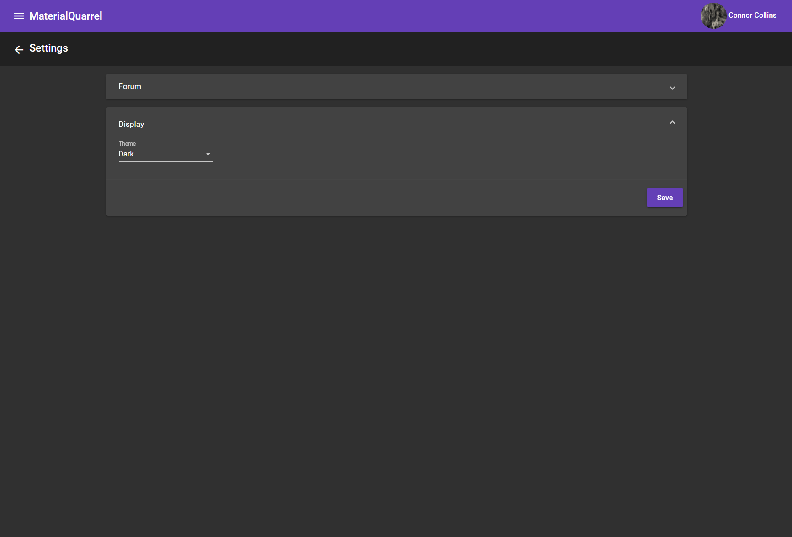
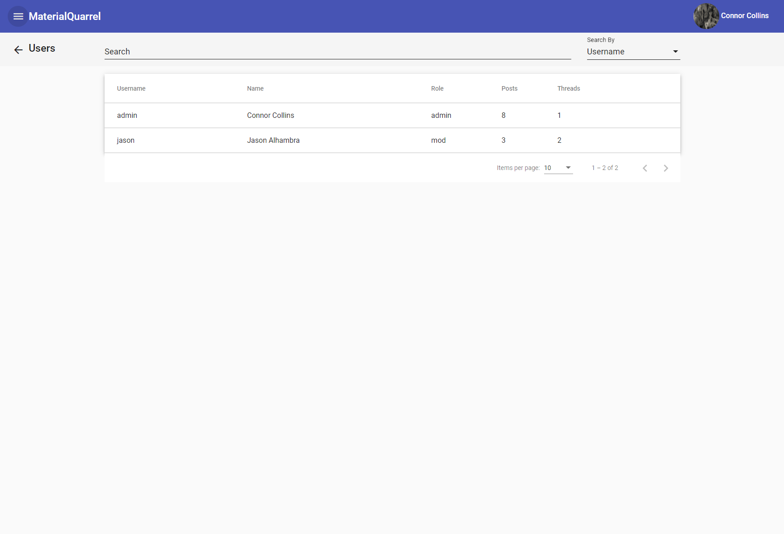

# MaterialQuarrel

The Material Angular frontend to Quarrel, a hobby project of mine.  Quarrel is a simple implementation of a forum that I started years ago and recently rewrote to its current version.  This version of Quarrel has the following updates:
- Upgraded from Angular.js to Angular
- Material design

# Screenshots

### Edit Post Dialog

### Sidenav / Account Settings

### Post Search

### Dark Theme Setting

### User List/Search/Stats

